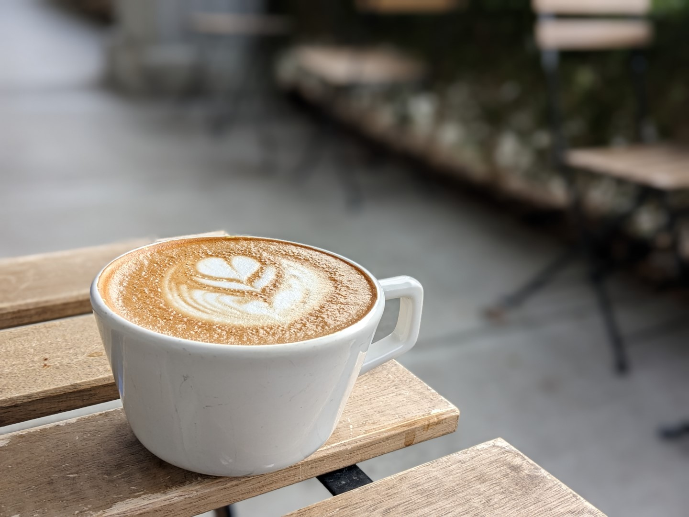

I was gifted an espresso machine over the weekend. I've been enjoying experimenting with it and have already seen pretty significant progress.  *That said, I've still got a long way to go.*

Getting the machine has me revisiting some of my favourite coffee spots and thinking about how damn good they are. As with all coffee, there's definitely a level of "tuning" you have to do to get "good coffee" (regardless of the method) but *man* there is really a bar between the stuff I'm pumping out and the cappuccino's from my favourite shops.

The cappuccino pictured above is from my favourite coffee shop (sorry, I'm gate keeping). I'm treating it as my bar for quality. I'll be happy when I can get a comparable cup at home.
