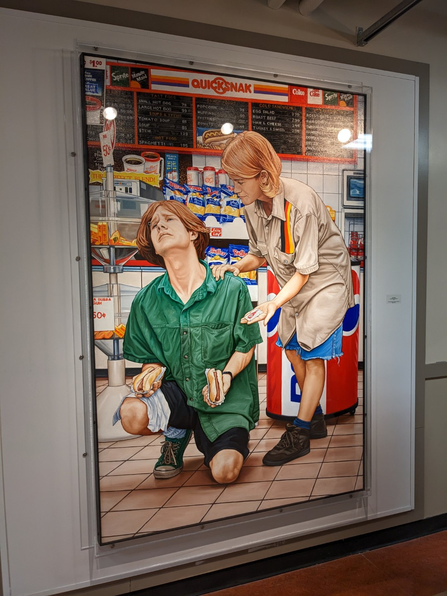

The painting above is titled "The Realm of Convenience II" and was painted by [Chris Woods](https://www.instagram.com/chris_woods_emporer/) in 1990.
It's maintained by and on display in the UFV Permanent Art Collection[^1]

## My history with the painting

This painting was on display between a bunch of classes I had at UFV and I would see it in passing regularly.
As a busy student, I always liked the painting, but never engaged with it more than a 30 second stare and a
"huh, that's a cool painting" on my way to somewhere else. Nevertheless, it left an impression on me as a cool piece of art.

It was moved closer to my office[^2] a few weeks ago and a friend/coworker asked if I'd seen the "Hot Dog Renaissance" painting yet.
I knew what they meant instantly. **Tell me that _doesn't_ look like a painting titled Hot Dog Renaissance**. We talked about it a bit and it got me wondering about the artist and the painting's background.

I walked down to the painting and took a look at the nameplate to the right of it which displayed the title, year painted, and artist's name;
_The Realm of Convenience II, 1990, Chris Woods._

The "II" at the end of the painting's name implies that there is at least a "I" in this series; [a quick google search proved that to be true](https://i0.wp.com/petleyjones.com/wp-content/uploads/2013/05/Woods-Chris-The-Realm-of-Convenience-I.jpg?ssl=1). After that search I sorta fell down a rabbit hole of Chris's art.

## Keeping record

**I was surprised to find no trace of "The Realm of Convenience II" anywhere on the internet.**

Given I couldn't find any other information about the painting, I figured I'd share a picture and a little writeup of my personal history with the painting here.
It's a great painting that I think deserves it's own little spot on the internet even if it's just for me and some friends.

edit: [a crunchy n' crusty scan of the photo exists on the SELIYEMETAXWTEXW art gallery wesbite](https://sag.ufvsoca.ca/sag/1994/05/15/chris-woods/). 

## Thanks Chris

Thanks to Chris Woods for making good art. 

[Check out his Instagram](https://www.instagram.com/chris_woods_emporer/) if you like the painting, he's got a pretty large body of work and appears to still be active. Some personal favourite's are ["Behold the King"](https://www.instagram.com/p/Bv2N4cHHju6/) and the ["Fast Food Nation" collection](http://www.pondly.com/2013/06/fast-food-nation-illustrations-by-chris-woods/).

[^1]: TIL that my workplace / graduating university has an art collection.
[^2]: I graduated with a Bachelor of Computer Information Systems from UFV in 2021; Post-grad I got a job in IT as a systems analyst.
